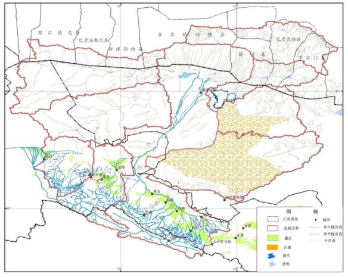

.. _chapter_1:
***************
第一章 基础数据
***************
1.流域边界数据
===============

* 比例尺：来自25m DEM（SRTM DEM 和ASTER GDEM 重采样） 
* 有效时间：SRTM数据是2000 年左右、ASTER GDEM数据在 1999-2008年 
* 坐标系统：WGS84/ALBERS 
* 数据类型：矢量多边形 
* 存储格式：ESRI Coverage/E00/Shape 
* 覆盖范围：新黑河流域边界 
* 数据说明： “流域科学计划”将使用新划定的黑河流域边界[1]，包括子流域边界，该边界是根据SRTM DEM和ASTER GDEM对黑河流域进行水文分析模拟，结合流域实测河流数据确定了黑河流域的边界情况。主要属性数据包括黑河流域的面积和周长，流域编码，其中包括了各个子流域的面积、周长、流域编码等属性。 

1.1黑河流域原有边界
-------------------
 文献中常见的黑河流域边界主要有四种，分别是:

#. 1985-1986年我国开始将黑河流域作为整体进行系统性的研究，在基础调查和掌握的大量资料的基础上，绘制了较早的黑河流域图（图 1a），流域面积 13.89 万 km^2。在水文单元划分中，整个流域被划分为三个水文平衡区，分别为黑河干流水系平衡区、北大河干流水系平衡区和马营-丰乐山前水系平衡区[2, 3]；
#.  “九五”国家重点科技攻关项目子专题“黑河流域水资源合理利用与经济社会和生态环境协调发展研究”，考虑了县级行政单元的完整性，在第一个流域边界的基础上利用当时的行政界线对流域边界进行了修订，形成了目前“数字黑河”信息系统(http://heihe.westgis.ac.cn)公布的黑河流域边界（图 1b），流域面积 12.87 万 km^2。在水文单元的划分上继承了原有的思路，划分为三大水系，分别为东部水系、中部水系和西部水系[4, 5]；
#. 针对朱镕基总理提出的关于黑河治理问题的指示，水利部在2000-2001年对黑河流域按水系进行了综合治理规划，在这次规划成果中，黑河流域面积 14.29 万 km2
（图 1c）。水文单元划分中西部和东部两个独立的水系，面积分别为 2.7 万 

.. math::
km^2 
和 11.6 万..math::km^2[6, 7];
#. 在 2002-2006 年开展的全国水资源综合规划中，“黄河流域（片）水资源综合规划”编制工作组于 2005 年编制《西北诸河水资源及其开发利用调查评价简要报告》，以水资源二级区和三级区为单位，完成了一系列自然地理与社会经济的统计表格和图件。在这次综合规划中，黑河流域的面积约为15.17万 km2(图1d)，该方案并没有给出更加详细的子流域划分方案[7, 8]；

2.参考文献
=================

